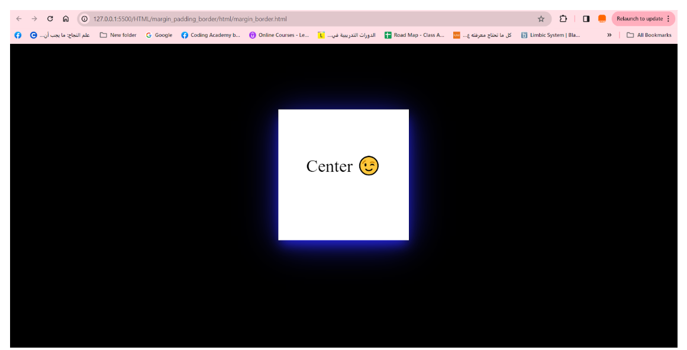
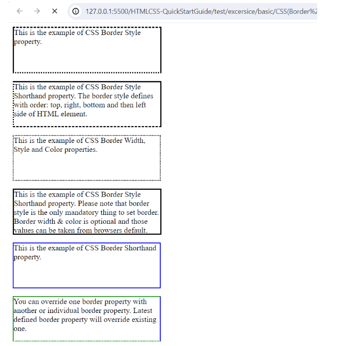

# CSS Task: Center a Div Using Margin and Padding

## Description
In this task, you will learn how to center a `div` both **horizontally** and **vertically** using CSS `margin` and `padding`. This is a fundamental skill for creating clean, balanced layouts in web design.

You will experiment with:
- **Margin**: To create space around the element and center it in the page.
- **Padding**: To add inner spacing inside the element, ensuring the content looks balanced.

---

### Instructions:
1. Create a `div` with some text inside.
2. Set a fixed width and height for the `div`.
3. Use **margin** to center it horizontally (hint: `margin: auto;`).
4. Add **padding** to give space inside the `div` around the text.
5. Apply a background color so the result is clearly visible.

---

### Task Image

---
### Bouns 

## Description
In this bonus task, you will create a simple web page that displays **6 boxes**, each with a different border style. This exercise will help you understand how CSS `border-style` works and how it can be used to enhance visual design.

---

### Instructions:
1. Create an HTML page with 6 `div` elements.
2. Apply a unique `border-style` to each `div` from the following:
   - `solid`
   - `dotted`
   - `dashed`
   - `double`
   - `groove`
   - `ridge`
3. Give each `div` a fixed width, height, and background color so the borders are easy to see.
4. Arrange the boxes neatly in the page layout.

---

### Task Image

---
