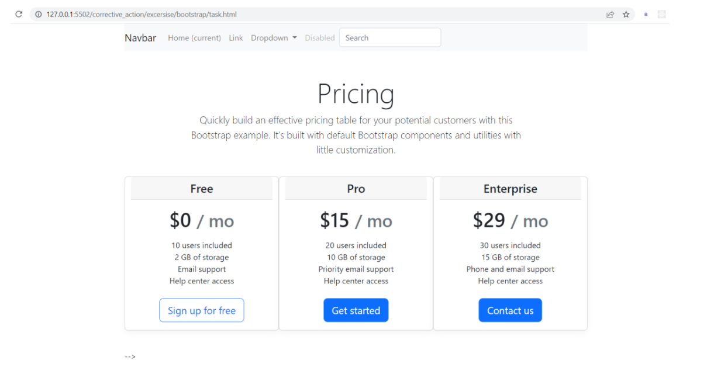
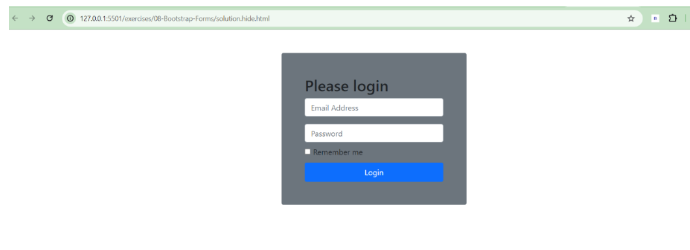

# CSS Task: Responsive-First Webpage Design

## Description
In this task, you will first build a **static webpage layout** based on the provided image, and then enhance it to be **responsive-first**—ensuring it works smoothly on mobile, tablet, and desktop devices.  
This will help you understand how to structure a layout and adapt it for different screen sizes using **media queries** and **flexible units**.

---

### Instructions:
1. **Create the Webpage Layout**  
   - Use HTML and CSS to recreate the design shown in the provided image.
   - Focus on correct structure, spacing, and styling.

2. **Make it Responsive-First**  
   - Start your CSS with mobile styles (smallest screen) first.
   - Use **relative units** (`%`, `em`, `rem`, `vh`, `vw`) where possible.
   - Add **media queries** for:
     - Tablet screens (e.g., `min-width: 768px`)
     - Desktop screens (e.g., `min-width: 1024px`)
   - Ensure images, text, and layouts adapt to screen width changes.

3. **Test Across Multiple Devices**  
   - Resize your browser window or use developer tools to test different breakpoints.
   - Ensure the content remains clear and usable at all screen sizes.

---

### Task Image

---
## CSS Task: Build a Webpage Using Bootstrap

## Description
In this task, you will create a webpage based on the provided design image, using **Bootstrap** as your main CSS framework.  
You will focus on utilizing Bootstrap's built-in grid system, components, and utility classes to recreate the layout efficiently.

---

### Instructions:
1. **Set Up Bootstrap**
   - Link Bootstrap CSS and JS via CDN in your HTML file.
   - Verify that Bootstrap styles are applied correctly.

2. **Recreate the Layout**
   - Use Bootstrap's **grid system** (`container`, `row`, `col`) to arrange content.
   - Implement responsive design using Bootstrap's column breakpoints (e.g., `col-sm-`, `col-md-`, `col-lg-`).
   - Use Bootstrap components such as:
     - **Navbar**
     - **Cards**
     - **Buttons**
     - **Forms** (if needed based on the design)

3. **Match the Provided Design**
   - Style your page to closely match the provided reference image.
   - Add Bootstrap utility classes for spacing, colors, and alignment.

4. **Make It Responsive**
   - Ensure the page adapts well to mobile, tablet, and desktop screen sizes.

---

### Task Image

---