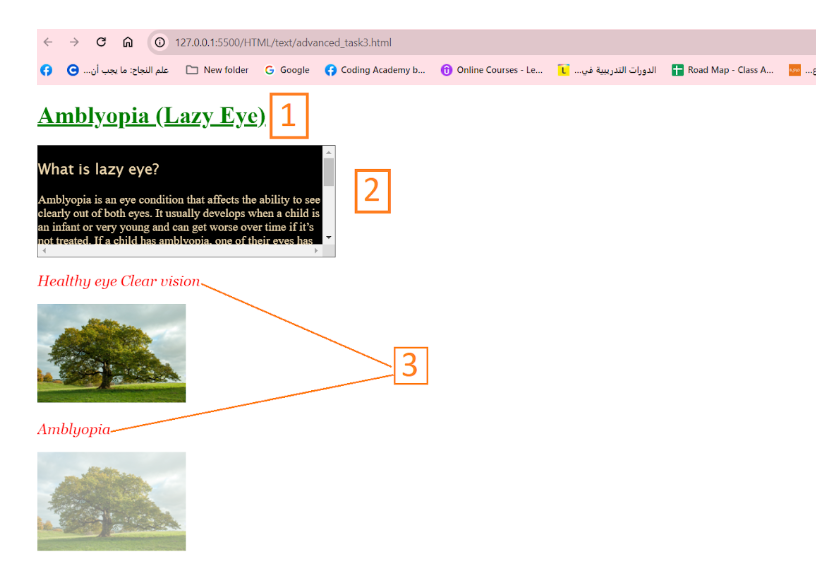
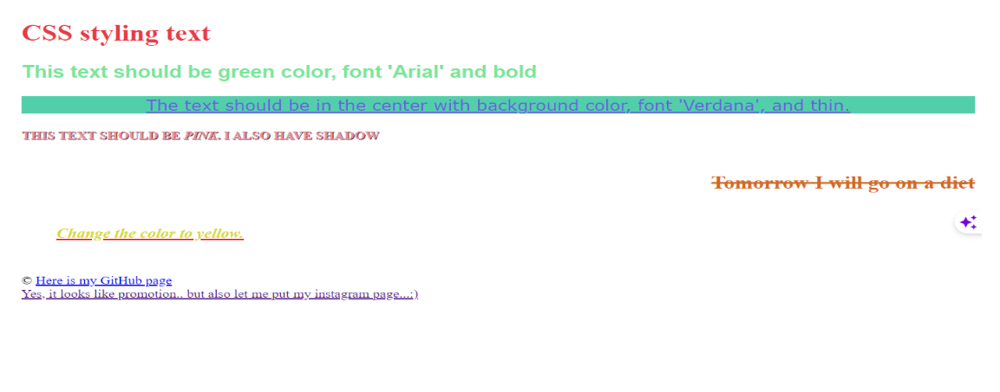

# CSS Task: Styling Elements

## Description
In this task, you will practice applying basic CSS styling techniques including text decoration, element sizing with scrollbars, and typography settings.

### Requirements:
1. Apply an **underline decoration** to text.
2. **Div Styling**:
   - Set the `width` of a `div` to **400px**.
   - Add **scrolling** functionality for overflowing content.
3. **Typography**:
   - Set the font family to:  
     `'Lucida Sans', 'Lucida Sans Regular', 'Lucida Grande', 'Lucida Sans Unicode', Geneva, Verdana, sans-serif`
   - Set the font size to **20px**.

---

### Task Image

---
### Bouns

## Description
In this task, you will practice applying essential CSS text and layout styling.  
You will work with:
- **Text-decoration** to style text underlines and other decorative lines.
- **Text-transform** to change the case of text (uppercase, lowercase, capitalize).
- **Text-align** to control text positioning (left, right, center, justify).
- **Font-style** to set italic or normal font appearance.  

The task also involves working with element sizing, scrollable content, and typography settings.

---

### Requirements:
1. Apply an **underline decoration** to text.
2. **Div Styling**:
   - Set the `width` of a `div` to **400px**.
   - Add **scrolling** functionality for overflowing content.
3. **Typography**:
   - Set the font family what you like.😉
   - Set the font size to **20px**.

---

### Task Image
