<div align="center">

# 🏢 Mini Admin CRM

### *Laravel-Powered Customer Relationship Management System*


[](https://opensource.org/licenses/MIT)
[](http://makeapullrequest.com)
[](https://github.com/yourusername/mini-admin-crm/stargazers)

**⏱️ Duration:** 5 Hours | **🎯 Level:** Intermediate | **🔐 Focus:** Authentication & Authorization

---

</div>

## 🚀 Project Overview

Welcome to **Mini Admin CRM** - a sophisticated Laravel-based Customer Relationship Management system that demonstrates advanced middleware implementation, role-based access control, and modern admin panel design. This application showcases the power of Laravel's authentication system with elegant UI/UX.

### 🎯 **Core Concept**
> **Public Landing** + **Protected Admin** = **Perfect CRM Architecture**

<div align="center">

| 👥 **User Type** | 🔓 **Access Level** | 🎯 **Capabilities** | 🎨 **Experience** |
|:----------------:|:------------------:|:-------------------:|:-----------------:|
| **🌐 Guest** | Public View | Browse public content | Clean, informative |
| **👨‍💼 Admin** | Full Control | CRUD operations | Rich admin dashboard |

</div>

---

## 🏗️ System Architecture

### 🔐 **Authentication Flow**

```mermaid
graph TD
    A[🌐 Landing Page] --> B{🔐 User Auth?}
    B -->|❌ Guest| C[👁️ Public View Only]
    B -->|✅ Admin| D[🏢 Admin Dashboard]
    D --> E[📊 Manage Components]
    E --> F[➕ Create]
    E --> G[👁️ Read]
    E --> H[✏️ Update]
    E --> I[🗑️ Delete]
    C --> J[📖 Browse Content]
```

<div align="center">



</div>

### 🎛️ **Core Components**

<table>
<tr>
  <td align="center">
    <br>
    <b>👥 Customers</b><br>
    <sub>Client management</sub>
  </td>
  <td align="center">
    <br>
    <b>🏢 Companies</b><br>
    <sub>Business entities</sub>
  </td>
  <td align="center">
    <br>
    <b>📁 Projects</b><br>
    <sub>Work management</sub>
  </td>
</tr>
</table>

---

## 🔒 Middleware & Security

### 🛡️ **Protection Layers**

<details>
<summary><b>🔐 Authentication Middleware</b> - Click to explore security</summary>

```php
// Custom Admin Middleware
class AdminMiddleware
{
    public function handle($request, Closure $next)
    {
        if (!Auth::check() || !Auth::user()->is_admin) {
            return redirect('/')->with('error', 'Admin access required');
        }
        return $next($request);
    }
}
```

**🎯 Route Protection:**
```php
// Public Routes (Guest Access)
Route::get('/', 'HomeController@index')->name('home');
Route::get('/public', 'PublicController@index')->name('public.index');

// Protected Admin Routes
Route::middleware(['auth', 'admin'])->group(function () {
    Route::resource('customers', CustomerController::class);
    Route::resource('companies', CompanyController::class);
    Route::resource('projects', ProjectController::class);
});
```

</details>

### 🎭 **User Roles & Permissions**

<div align="center">

| 🏷️ **Role** | 🔓 **Landing Page** | 👁️ **View Public** | ➕ **Create** | ✏️ **Update** | 🗑️ **Delete** |
|:-----------:|:------------------:|:------------------:|:-------------:|:-------------:|:-------------:|
| **🌐 Guest** | ✅ | ✅ | ❌ | ❌ | ❌ |
| **👨‍💼 Admin** | ✅ | ✅ | ✅ | ✅ | ✅ |

</div>

---

## 🎨 User Interface Design

### 🌐 **Public Landing Experience**

<div align="center">

#### **For Guest Users** 👥

| 📱 **Component** | 🎯 **Purpose** | ✨ **Features** |
|:----------------:|:--------------:|:---------------:|
| **🏠 Landing Page** | Welcome & Overview | Hero section, stats, testimonials |
| **📖 Public Gallery** | Browse content | Cards, filters, pagination |
| **ℹ️ About Section** | Company info | Mission, vision, team |
| **📞 Contact** | Get in touch | Form, location, details |

</div>

### 🏢 **Admin Dashboard Experience**

<div align="center">

#### **For Admin Users** 👨‍💼

| 📊 **Section** | 🎯 **Purpose** | 🛠️ **Actions** |
|:--------------:|:--------------:|:---------------:|
| **📈 Dashboard** | Overview & Analytics | Statistics, charts, quick actions |
| **👥 Customers** | Client Management | CRUD operations, search, filter |
| **🏢 Companies** | Business Management | Company profiles, relationships |
| **📁 Projects** | Work Management | Project tracking, status updates |

</div>

---

## 🛠️ Technical Implementation

### 📋 **Models & Relationships**

<details>
<summary><b>👥 Customer Model</b></summary>

```php
class Customer extends Model
{
    protected $fillable = [
        'name',
        'email', 
        'phone',
        'address',
        'company_id',
        'status',
        'is_public'
    ];

    public function company()
    {
        return $this->belongsTo(Company::class);
    }

    public function projects()
    {
        return $this->hasMany(Project::class);
    }
}
```

</details>

<details>
<summary><b>🏢 Company Model</b></summary>

```php
class Company extends Model
{
    protected $fillable = [
        'name',
        'description',
        'website',  
        'industry',
        'size',
        'is_public'
    ];

    public function customers()
    {
        return $this->hasMany(Customer::class);
    }

    public function projects()
    {
        return $this->hasMany(Project::class);
    }
}
```

</details>

<details>
<summary><b>📁 Project Model</b></summary>

```php
class Project extends Model
{
    protected $fillable = [
        'title',
        'description',
        'start_date',
        'end_date',
        'status',
        'budget',
        'customer_id',
        'company_id',
        'is_public'
    ];

    public function customer()
    {
        return $this->belongsTo(Customer::class);
    }

    public function company()
    {
        return $this->belongsTo(Company::class);
    }
}
```

</details>

---

## 🛣️ Route Architecture

### 🌐 **Public Routes** (No Authentication Required)

| 🌐 **Method** | 📍 **URI** | 🎯 **Action** | 🏷️ **Route Name** | 👥 **Access** |
|:-------------:|:----------:|:-------------:|:-----------------:|:--------------:|
| `GET` | `/` | Landing page | `home` | 🌐 Everyone |
| `GET` | `/public/customers` | Public customers | `public.customers` | 🌐 Everyone |
| `GET` | `/public/companies` | Public companies | `public.companies` | 🌐 Everyone |
| `GET` | `/public/projects` | Public projects | `public.projects` | 🌐 Everyone |

### 🔒 **Protected Admin Routes** (Authentication Required)

<div align="center">

#### 👥 **Customers Management**
| 🌐 **Method** | 📍 **URI** | 🎯 **Action** | 🏷️ **Route Name** |
|:-------------:|:----------:|:-------------:|:-----------------:|
| `GET` | `/admin/customers` | List all | `customers.index` |
| `GET` | `/admin/customers/create` | Create form | `customers.create` |
| `POST` | `/admin/customers` | Store new | `customers.store` |
| `GET` | `/admin/customers/{id}` | Show details | `customers.show` |
| `GET` | `/admin/customers/{id}/edit` | Edit form | `customers.edit` |
| `PUT` | `/admin/customers/{id}` | Update | `customers.update` |
| `DELETE` | `/admin/customers/{id}` | Delete | `customers.destroy` |

#### 🏢 **Companies Management**
| 🌐 **Method** | 📍 **URI** | 🎯 **Action** | 🏷️ **Route Name** |
|:-------------:|:----------:|:-------------:|:-----------------:|
| `GET` | `/admin/companies` | List all | `companies.index` |
| `GET` | `/admin/companies/create` | Create form | `companies.create` |
| `POST` | `/admin/companies` | Store new | `companies.store` |
| `GET` | `/admin/companies/{id}` | Show details | `companies.show` |
| `GET` | `/admin/companies/{id}/edit` | Edit form | `companies.edit` |
| `PUT` | `/admin/companies/{id}` | Update | `companies.update` |
| `DELETE` | `/admin/companies/{id}` | Delete | `companies.destroy` |

#### 📁 **Projects Management**
| 🌐 **Method** | 📍 **URI** | 🎯 **Action** | 🏷️ **Route Name** |
|:-------------:|:----------:|:-------------:|:-----------------:|
| `GET` | `/admin/projects` | List all | `projects.index` |
| `GET` | `/admin/projects/create` | Create form | `projects.create` |
| `POST` | `/admin/projects` | Store new | `projects.store` |
| `GET` | `/admin/projects/{id}` | Show details | `projects.show` |
| `GET` | `/admin/projects/{id}/edit` | Edit form | `projects.edit` |
| `PUT` | `/admin/projects/{id}` | Update | `projects.update` |
| `DELETE` | `/admin/projects/{id}` | Delete | `projects.destroy` |

</div>

---

## ⚡ Quick Start Guide

### 🚀 **Installation & Setup**

```bash
# 🏢 Clone your CRM empire
git clone https://github.com/yourusername/mini-admin-crm.git
cd mini-admin-crm

# 📦 Install dependencies
composer install
npm install

# 🔑 Environment setup
cp .env.example .env
php artisan key:generate

# 🗄️ Database setup
php artisan migrate
php artisan db:seed --class=AdminUserSeeder

# 🎨 Compile assets
npm run dev

# 🚀 Launch your CRM
php artisan serve
```

### ⚙️ **Environment Configuration**

```env
# 🏢 CRM Database Settings  
DB_CONNECTION=mysql
DB_HOST=127.0.0.1
DB_PORT=3306
DB_DATABASE=mini_admin_crm
DB_USERNAME=your_username
DB_PASSWORD=your_password

# 🔐 Authentication Settings
APP_NAME="Mini Admin CRM"
APP_ENV=local
APP_DEBUG=true
APP_URL=http://localhost:8000

# 📧 Mail Configuration (for notifications)
MAIL_MAILER=smtp
MAIL_HOST=smtp.gmail.com
MAIL_PORT=587
MAIL_USERNAME=your_email@gmail.com
MAIL_PASSWORD=your_password
```

### 👨‍💼 **Default Admin Credentials**

```php
// Default admin user (created by seeder)
Email: admin@minicrm.com
Password: admin123

// Test guest access at: http://localhost:8000
// Admin panel access: http://localhost:8000/login
```

---

## 📁 Project Structure

```
🏢 Mini Admin CRM/
├── 📱 app/
│   ├── 🎭 Models/
│   │   ├── 👤 User.php
│   │   ├── 👥 Customer.php
│   │   ├── 🏢 Company.php
│   │   └── 📁 Project.php
│   ├── 🎮 Http/
│   │   ├── Controllers/
│   │   │   ├── 🏠 HomeController.php
│   │   │   ├── 🌐 PublicController.php
│   │   │   ├── 👥 CustomerController.php
│   │   │   ├── 🏢 CompanyController.php
│   │   │   └── 📁 ProjectController.php
│   │   └── 🛡️ Middleware/
│   │       └── 👨‍💼 AdminMiddleware.php
├── 🎨 resources/views/
│   ├── 📐 layouts/
│   │   ├── 🌐 public.blade.php
│   │   └── 👨‍💼 admin.blade.php
│   ├── 🏠 home/
│   │   └── index.blade.php
│   ├── 🌐 public/
│   │   ├── customers.blade.php
│   │   ├── companies.blade.php
│   │   └── projects.blade.php
│   └── 👨‍💼 admin/
│       ├── 📊 dashboard.blade.php
│       ├── 👥 customers/
│       ├── 🏢 companies/
│       └── 📁 projects/
├── 🗄️ database/
│   ├── 📋 migrations/
│   └── 🌱 seeders/
└── 🛣️ routes/
    └── web.php
```

---

## ✨ Feature Showcase

<div align="center">

### 🎯 **Core CRM Features**

<table>
<tr>
<td width="50%">

#### 🔐 **Security & Authentication**
- ✅ **Custom Admin Middleware**
- ✅ **Role-based Access Control**
- ✅ **Protected Admin Routes**
- ✅ **Public Content Filtering**
- ✅ **Session Management**
- ✅ **CSRF Protection**

</td>
<td width="50%">

#### 🏢 **Business Management**
- ✅ **Customer Relationship Management**
- ✅ **Company Portfolio Management**
- ✅ **Project Tracking System**
- ✅ **Public/Private Content Toggle**
- ✅ **Advanced Search & Filtering**
- ✅ **Data Analytics Dashboard**

</td>
</tr>
</table>

### 🎨 **User Experience Features**

<table>
<tr>
<td width="50%">

#### 🌐 **Public Interface**
- ✅ **Responsive Landing Page**
- ✅ **Public Content Gallery**
- ✅ **Mobile-First Design**
- ✅ **SEO Optimized**
- ✅ **Fast Loading**
- ✅ **Clean Navigation**

</td>
<td width="50%">

#### 👨‍💼 **Admin Dashboard**
- ✅ **Rich Admin Interface**
- ✅ **Data Visualization**
- ✅ **Bulk Operations**
- ✅ **Export Functionality**
- ✅ **Real-time Notifications**
- ✅ **Intuitive Workflows**

</td>
</tr>
</table>

</div>

---

## 🛠️ Technology Stack

<div align="center">

### **🏗️ Backend Foundation**


### **🗄️ Database & Storage**  


### **🎨 Frontend Excellence**


### **🔐 Security & Tools**


</div>

---

## 🎓 Learning Objectives

<div align="center">

### 🧠 **Advanced Laravel Concepts**

<table>
<tr>
<td width="33%">

#### 🔐 **Authentication**
- ✅ Custom Middleware
- ✅ Route Protection
- ✅ User Roles
- ✅ Session Management
- ✅ Access Control
- ✅ Security Best Practices

</td>
<td width="33%">

#### 🏗️ **Architecture**
- ✅ MVC Pattern
- ✅ RESTful Design
- ✅ Database Relations
- ✅ Migration Systems
- ✅ Seeding Data
- ✅ Model Factories

</td>
<td width="33%">

#### 🎨 **Frontend Integration**
- ✅ Blade Components
- ✅ Layout Inheritance
- ✅ Form Handling
- ✅ Asset Compilation
- ✅ AJAX Requests
- ✅ UI/UX Design

</td>
</tr>
</table>

</div>

---

## 📊 Sample Data Structure

<details>
<summary><b>🏢 Click to see sample CRM data</b></summary>

```php
// Sample Companies
$companies = [
    [
        'name' => 'Tech Solutions Inc.',
        'description' => 'Leading software development company',
        'website' => 'https://techsolutions.com',
        'industry' => 'Technology',
        'size' => 'Medium',
        'is_public' => true
    ]
];

// Sample Customers
$customers = [
    [
        'name' => 'John Smith',
        'email' => 'john@example.com',
        'phone' => '+1-555-0123',
        'address' => '123 Business St, City, State',
        'company_id' => 1,
        'status' => 'Active',
        'is_public' => true
    ]
];

// Sample Projects
$projects = [
    [
        'title' => 'Website Redesign',
        'description' => 'Complete overhaul of company website',
        'start_date' => '2024-01-15',
        'end_date' => '2024-03-15',
        'status' => 'In Progress',
        'budget' => 15000.00,
        'customer_id' => 1,
        'company_id' => 1,
        'is_public' => true
    ]
];
```

</details>

---

## 🤝 Contributing

<div align="center">

**Join our CRM development team! 🏢**

[](http://makeapullrequest.com)
[](https://github.com/yourusername/mini-admin-crm/issues)

### **Ways to Contribute:**
- 🐛 **Bug Reports** - Help us improve stability
- 💡 **Feature Requests** - Share your innovative ideas  
- 📝 **Documentation** - Enhance our guides
- 🔧 **Code Contributions** - Submit quality PRs
- 🎨 **UI/UX Improvements** - Make it more beautiful
- 🔐 **Security Enhancements** - Strengthen our defenses

</div>

---

## 📜 License

<div align="center">

This project is licensed under the **MIT License** - see the [LICENSE](LICENSE) file for details.

[](https://opensource.org/licenses/MIT)

*Open source and free to use! 🎉*

</div>

---

## 🌟 Acknowledgments

<div align="center">

### **Special Recognition:**
- 🏢 **Laravel Team** - For the incredible framework
- 🔐 **Security Community** - For best practices guidance
- 🎨 **Bootstrap Team** - For responsive components
- 👥 **CRM Industry** - For inspiration and requirements
- 💖 **Open Source Community** - For continuous support

</div>

---

<div align="center">

### 🎯 **Ready to Build Your CRM Empire?**

**If this project inspired your Laravel journey:**

⭐ **Star this repository**  
🍴 **Fork for your own CRM**  
📢 **Share with your network**  
💬 **Provide valuable feedback**  
🤝 **Contribute to improvements**

---

**🎬 Made with ❤️ and lots of ☕ by [OrangeAcademyTeam]**


### *"Great businesses are built on great relationships. Start managing yours today!" 🏢✨*

**Happy CRM Building! 🚀**

</div>